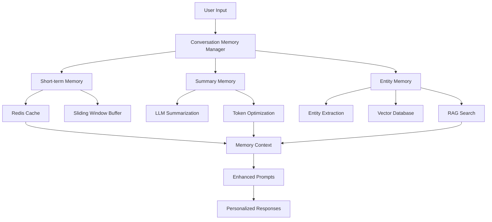

# Conversation Memory System

Project Maestro now features an advanced 3-tier conversation memory system that provides intelligent, context-aware interactions while optimizing token usage and enabling personalized experiences.

## 🧠 Memory Architecture Overview

### 3-Tier Memory System



## 💡 Key Features

### 🔄 Short-term Memory (ConversationBufferWindowMemory)
- **Purpose**: Maintains recent conversation flow
- **Storage**: Redis with sliding window
- **Window Size**: Configurable (default: 10 messages)
- **TTL**: 24 hours
- **Benefits**: Fast access, immediate context

### 📝 Summary Memory (ConversationSummaryMemory)  
- **Purpose**: Compresses long conversations
- **Method**: LLM-based intelligent summarization
- **Trigger**: Token threshold exceeded (default: 2000 tokens)
- **Compression**: 50-70% token reduction
- **Benefits**: Cost optimization, context preservation

### 🎯 Entity Memory (Long-term/Persistent)
- **Purpose**: Learns user preferences and patterns
- **Storage**: Vector database with RAG search
- **Extraction**: LLM-based entity recognition
- **Retrieval**: Similarity-based relevant context
- **Benefits**: Personalization, continuity across sessions

## 🚀 Game Development Benefits

### Personalized Game Recommendations
```python
# System remembers user preferences
User: "I want to create another game"
AI: "Based on your previous platformer project and love for pixel art, 
     would you like to try a puzzle-platformer this time? 
     I remember you enjoyed working with expressive character animations."
```

### Project Continuity
```python
# Maintains context across sessions
User: "How's my game project going?"
AI: "Your mobile platformer 'PixelJump' is 60% complete. 
     Last session we finished the character controller. 
     Ready to work on level design next?"
```

### Learning Patterns
```python
# Adapts to user's development style
AI: "I notice you prefer starting with game mechanics before art. 
     Should we prototype the jump physics first?"
```

## ⚙️ Configuration

### Environment Variables

```env
# Memory System Core
CONVERSATION_MEMORY_ENABLED=true
MEMORY_REDIS_DB=3

# Short-term Memory  
SHORT_TERM_MEMORY_WINDOW_SIZE=10
SHORT_TERM_MEMORY_TTL_HOURS=24

# Summary Memory
SUMMARY_MEMORY_ENABLED=true
SUMMARY_MEMORY_MODEL=gpt-3.5-turbo
SUMMARY_MEMORY_MAX_TOKENS=2000
SUMMARY_MEMORY_TTL_DAYS=7

# Entity Extraction
ENTITY_EXTRACTION_ENABLED=true
ENTITY_EXTRACTION_MODEL=gpt-3.5-turbo
ENTITY_EXTRACTION_CONFIDENCE_THRESHOLD=0.7

# Vector Memory
VECTOR_MEMORY_ENABLED=true
VECTOR_MEMORY_EMBEDDING_MODEL=text-embedding-ada-002
VECTOR_MEMORY_SIMILARITY_THRESHOLD=0.7
```

### Performance Tuning

```env
# Performance Settings
MEMORY_ASYNC_PROCESSING=true
MEMORY_CACHE_SIZE=1000
MEMORY_PROCESSING_TIMEOUT=30

# Cost Optimization
SUMMARY_MEMORY_MAX_TOKENS=1500  # Lower for more aggressive summarization
ENTITY_EXTRACTION_BATCH_SIZE=3   # Smaller batches for cost control
```

## 🔧 Implementation Guide

### Basic Usage

```python
from src.project_maestro.core.conversation_memory import ConversationMemoryManager
from langchain_openai import ChatOpenAI

# Initialize memory manager
llm = ChatOpenAI(model="gpt-3.5-turbo")
memory_manager = ConversationMemoryManager(llm)

# Store conversation
await memory_manager.store_message(
    HumanMessage(content="I want to create a platformer game"),
    user_id="user_123",
    session_id="session_456"
)

# Get memory context for enhanced prompts
context = await memory_manager.get_memory_context(
    user_id="user_123",
    session_id="session_456", 
    current_query="What art style should I use?"
)

# Use context in prompt
enhanced_prompt = context.to_prompt_context() + "\n\nUser question: What art style should I use?"
```

### LangGraph Integration

```python
from src.project_maestro.core.langgraph_orchestrator import LangGraphOrchestrator

# Memory is automatically integrated
orchestrator = LangGraphOrchestrator(
    agents=agents,
    llm=llm,
    enable_conversation_memory=True  # Default: True
)

# Memory context is automatically added to MaestroState
state = {
    "user_id": "user_123",
    "session_id": "session_456", 
    "messages": [HumanMessage(content="User input")]
}
```

## 📊 Entity Types Extracted

### User Profile Information
- **user_profile**: Name, experience level, role (indie dev, student, professional)
- **development_skill**: Programming languages, engines, tools, artistic abilities

### Game Development Preferences  
- **game_preference**: Preferred genres (RPG, platformer, puzzle, FPS, etc.)
- **art_style**: Visual preferences (pixel art, 3D, cartoon, realistic, minimalist)
- **platform_preference**: Target platforms (mobile, PC, console, web)
- **character_preference**: Character types, personality traits, visual styles

### Project & Behavioral Patterns
- **project_history**: Previous projects, successes, failures, lessons learned
- **feedback_pattern**: How user responds to suggestions, preferences, dislikes

### Example Entity Extraction

```json
{
  "type": "game_preference",
  "content": "Prefers platformer games with tight controls and responsive mechanics, inspired by Celeste and Super Meat Boy",
  "confidence": 0.92,
  "metadata": {
    "genres": ["platformer"],
    "inspirations": ["Celeste", "Super Meat Boy"],
    "focus": "tight_controls"
  }
}
```

## 🎯 Memory Context Usage

### Context Structure

```python
@dataclass
class MemoryContext:
    short_term_messages: List[BaseMessage]      # Recent conversation
    summary: Optional[str]                      # Conversation summary
    relevant_entities: List[Entity]             # User-specific knowledge
    token_count: int                           # Total context tokens
```

### Prompt Enhancement

```python
def enhance_prompt_with_memory(base_prompt: str, context: MemoryContext) -> str:
    """Enhance prompt with memory context."""
    context_parts = []
    
    # Add user knowledge
    if context.relevant_entities:
        user_info = []
        for entity in context.relevant_entities:
            user_info.append(f"- {entity.type}: {entity.content}")
        context_parts.append("User Information:\n" + "\n".join(user_info))
    
    # Add conversation summary
    if context.summary:
        context_parts.append(f"Previous Discussion: {context.summary}")
    
    # Add recent messages
    if context.short_term_messages:
        recent = []
        for msg in context.short_term_messages[-3:]:
            role = "User" if isinstance(msg, HumanMessage) else "Assistant"
            recent.append(f"{role}: {msg.content}")
        context_parts.append("Recent Context:\n" + "\n".join(recent))
    
    enhanced_prompt = "\n\n".join(context_parts) + f"\n\n{base_prompt}"
    return enhanced_prompt
```

## 🔍 Monitoring & Analytics

### Memory System Metrics

```python
# Token efficiency tracking
original_tokens = len(full_conversation) // 4
memory_tokens = context.token_count
efficiency = (original_tokens - memory_tokens) / original_tokens
print(f"Token efficiency: {efficiency:.2%}")

# Entity extraction success rate
successful_extractions = len([e for e in entities if e.confidence > 0.7])
extraction_rate = successful_extractions / total_messages
print(f"Entity extraction rate: {extraction_rate:.2%}")

# Memory retrieval relevance
relevant_retrievals = len([e for e in retrieved_entities if user_query_matches(e)])
relevance_score = relevant_retrievals / len(retrieved_entities)
print(f"Retrieval relevance: {relevance_score:.2%}")
```

### Performance Benchmarks

| Metric | Target | Typical Performance |
|--------|--------|-------------------|
| Short-term retrieval | <100ms | 15-50ms |
| Summarization | <3s | 1-2s |
| Entity extraction | <5s | 2-4s |
| Vector search | <200ms | 50-150ms |
| Total context generation | <8s | 3-6s |

## 🛠️ Advanced Features

### Custom Entity Types

```python
class CustomEntityType(str, Enum):
    GAME_MONETIZATION = "game_monetization"
    MARKETING_STRATEGY = "marketing_strategy"
    TECHNICAL_CONSTRAINT = "technical_constraint"

# Register custom extractors
extractor.register_custom_type(
    entity_type=CustomEntityType.GAME_MONETIZATION,
    extraction_prompt="Extract information about preferred monetization models...",
    confidence_threshold=0.8
)
```

### Memory Lifecycle Management

```python
# Session lifecycle
await memory_manager.start_session(user_id, session_id)
await memory_manager.end_session(user_id, session_id)

# Data retention
await memory_manager.cleanup_expired_memories()

# User data management
await memory_manager.export_user_data(user_id)
await memory_manager.delete_user_data(user_id)  # GDPR compliance
```

### Cross-Session Learning

```python
# Learn from multiple sessions
user_patterns = await memory_manager.analyze_user_patterns(user_id)

# Generate user insights
insights = await memory_manager.get_user_insights(user_id)
# Returns: ["Prefers iterative development", "Struggles with art creation", ...]

# Suggest based on history
suggestions = await memory_manager.get_personalized_suggestions(user_id, current_project)
```

## 🔒 Privacy & Security

### Data Protection
- **User Isolation**: Each user's memory is stored in separate namespaces
- **Encryption**: Sensitive data encrypted at rest
- **TTL Management**: Automatic expiration of old data
- **GDPR Compliance**: User data export and deletion capabilities

### Configuration for Privacy

```env
# Privacy settings
MEMORY_ENCRYPT_ENTITIES=true
MEMORY_ANONYMIZE_LOGS=true  
MEMORY_AUDIT_ENABLED=true
MEMORY_RETENTION_DAYS=90
```

## 🧪 Testing & Validation

### Running Memory Tests

```bash
# Run memory system tests
pytest tests/test_conversation_memory.py -v

# Performance benchmarks
pytest tests/test_conversation_memory.py::TestMemorySystemIntegration::test_memory_system_performance -v

# Token efficiency tests  
pytest tests/test_conversation_memory.py::TestSummaryMemory::test_token_efficiency -v
```

### Test Coverage Areas
- ✅ Short-term memory sliding window
- ✅ Summary generation and compression
- ✅ Entity extraction accuracy
- ✅ Vector search relevance
- ✅ Performance under load
- ✅ Memory integration with LangGraph
- ✅ Token efficiency optimization

## 🚨 Troubleshooting

### Common Issues

**High Token Usage**
```bash
# Check summarization settings
echo $SUMMARY_MEMORY_MAX_TOKENS
# Reduce threshold for more aggressive summarization
export SUMMARY_MEMORY_MAX_TOKENS=1500
```

**Poor Entity Extraction**
```bash
# Check confidence threshold
echo $ENTITY_EXTRACTION_CONFIDENCE_THRESHOLD
# Lower threshold for more extractions
export ENTITY_EXTRACTION_CONFIDENCE_THRESHOLD=0.6
```

**Slow Memory Retrieval**
```bash
# Check vector search settings
echo $VECTOR_MEMORY_MAX_RESULTS
# Reduce results for faster retrieval
export VECTOR_MEMORY_MAX_RESULTS=5
```

**Redis Memory Usage**
```bash
# Check Redis memory usage
redis-cli info memory
# Adjust TTL settings
export SHORT_TERM_MEMORY_TTL_HOURS=12
export SUMMARY_MEMORY_TTL_DAYS=3
```

### Debugging Tools

```python
# Enable detailed logging
import logging
logging.getLogger("conversation_memory").setLevel(logging.DEBUG)

# Memory inspection
context = await memory_manager.get_memory_context(user_id, session_id)
print(f"Memory tokens: {context.token_count}")
print(f"Entities: {len(context.relevant_entities)}")
print(f"Summary length: {len(context.summary) if context.summary else 0}")

# Performance profiling
import time
start = time.time()
await memory_manager.store_message(message, user_id, session_id)
print(f"Storage time: {time.time() - start:.2f}s")
```

## 📈 Future Enhancements

### Planned Features
- **Multi-modal Memory**: Image and audio content memory
- **Collaborative Memory**: Shared memory for team projects
- **Federated Learning**: Cross-user pattern learning (privacy-preserving)
- **Advanced Analytics**: Detailed user behavior insights
- **Memory Compression**: More efficient storage algorithms

### Research Areas
- **Hierarchical Summarization**: Multi-level conversation summaries
- **Semantic Clustering**: Better entity organization
- **Predictive Context**: Anticipating user needs
- **Memory Consolidation**: Long-term knowledge synthesis

---

The conversation memory system transforms Project Maestro from a stateless assistant to an intelligent, learning partner that grows with each interaction, providing increasingly personalized and effective game development support.