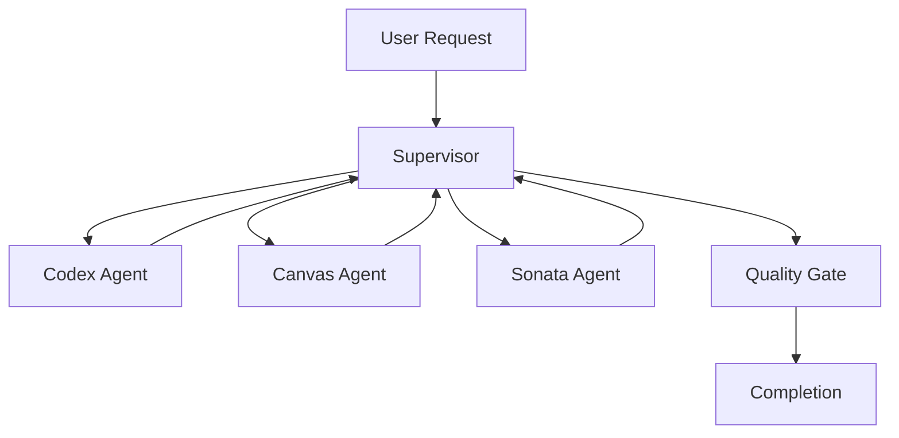

# LangGraph Implementation Guide for Project Maestro

## Overview

Project Maestro now leverages **LangGraph** for sophisticated multi-agent orchestration, moving beyond traditional ReAct frameworks to provide state-of-the-art agent coordination capabilities. This implementation combines the power of LangGraph's graph-based workflows with our specialized game development agents.

## Architecture Evolution

### Before: ReAct Framework
- Single-agent execution with AgentExecutor
- Limited inter-agent communication
- Sequential task processing
- Basic state management

### After: LangGraph Multi-Agent System
- Graph-based multi-agent orchestration
- Intelligent agent handoffs
- Parallel and sequential execution patterns
- Persistent state management with checkpointing
- Advanced workflow visualization

## Core Components

### 1. LangGraphOrchestrator

The central orchestration engine that manages all agent interactions:

```python
from project_maestro.core.langgraph_orchestrator import LangGraphOrchestrator

# Initialize with specialized agents
orchestrator = LangGraphOrchestrator(
    agents={
        "codex": codex_agent,
        "canvas": canvas_agent, 
        "sonata": sonata_agent,
        "labyrinth": labyrinth_agent,
        "builder": builder_agent
    },
    llm=llm_instance
)

# Execute complex workflows
async for result in orchestrator.execute_workflow(
    request="Create a 2D platformer game with custom music",
    thread_id="unique_session_id"
):
    print(result)
```

### 2. Enhanced State Management

**MaestroState** provides comprehensive workflow tracking:

```python
class MaestroState(TypedDict):
    messages: Annotated[Sequence[BaseMessage], add_messages]
    current_agent: str
    task_context: Dict[str, Any]
    game_design_doc: Optional[Dict[str, Any]]
    assets_generated: Dict[str, List[str]]
    code_artifacts: Dict[str, str]
    build_status: Dict[str, Any]
    workflow_stage: str
    handoff_history: List[Dict[str, Any]]
    execution_metadata: Dict[str, Any]
```

### 3. Intelligent Agent Routing

Agents are selected based on capabilities and current context:

```python
agent_capabilities = {
    "codex": AgentCapability(
        agent_name="codex",
        specializations=["csharp_code", "unity_scripting", "gameplay_logic"],
        prerequisites=["game_design_doc"],
        outputs=["csharp_scripts", "unity_components"]
    ),
    "canvas": AgentCapability(
        agent_name="canvas", 
        specializations=["visual_assets", "ui_design", "textures", "sprites"],
        outputs=["images", "ui_components", "visual_assets"]
    )
    # ... additional agents
}
```

## Workflow Patterns

### 1. Supervisor Pattern

Central coordinator routes tasks to specialized agents:



### 2. Agent Handoff Pattern

Agents can transfer control to other agents:

```python
@tool
def transfer_to_canvas(task_description: str) -> Command:
    """Transfer visual asset creation to Canvas agent."""
    return Command(
        goto="canvas",
        update={
            "task_context": {
                "description": task_description,
                "requested_by": "codex"
            }
        }
    )
```

### 3. Parallel Execution

Independent tasks execute simultaneously:

```python
# Multiple agents work in parallel
workflow_stages = [
    "audio_generation",  # Sonata Agent
    "visual_generation", # Canvas Agent  
    "code_generation"    # Codex Agent
]
```

## Integration Points

### 1. Enhanced Orchestrator Agent

The `OrchestratorAgent` now serves as both a traditional agent and LangGraph entry point:

```python
class OrchestratorAgent(BaseAgent):
    def __init__(self, **kwargs):
        super().__init__(...)
        self.langgraph_orchestrator = None
        
    async def _execute_langgraph_workflow(self, request: str):
        """Execute using LangGraph orchestration."""
        if not self.langgraph_orchestrator:
            self._initialize_langgraph_orchestrator(agents)
            
        async for chunk in self.langgraph_orchestrator.execute_workflow(
            request=request,
            thread_id=thread_id
        ):
            yield chunk
```

### 2. Backward Compatibility

Existing functionality remains available:

```python
# Traditional workflow (for simple projects)
if complexity_score <= 0.7:
    await self.execute_workflow()  # Traditional approach
else:
    # LangGraph orchestration (for complex projects)
    await self._execute_langgraph_workflow(request)
```

## Usage Examples

### Example 1: Simple Game Creation

```python
# Initialize orchestrator
orchestrator = LangGraphOrchestrator(agents, llm)

# Create a simple game
request = "Create a simple Pong game with sound effects"
async for result in orchestrator.execute_workflow(request):
    print(f"Progress: {result}")
```

### Example 2: Complex Game Development

```python
# Complex game with multiple requirements
request = """
Create a 2D RPG game with:
- Turn-based combat system
- Custom pixel art graphics
- Original background music
- Multiple levels with progression
- Character dialogue system
"""

# Execute with state persistence
thread_id = "rpg_project_001"
async for result in orchestrator.execute_workflow(request, thread_id):
    print(f"Stage: {result.get('workflow_stage', 'unknown')}")
```

### Example 3: Workflow Visualization

```python
# Get Mermaid diagram of workflow
mermaid_diagram = orchestrator.visualize_graph()
print(mermaid_diagram)

# Save to file for documentation
with open("workflow_diagram.md", "w") as f:
    f.write(f"```mermaid\n{mermaid_diagram}\n```")
```

## Configuration

### Environment Variables

```bash
# LangGraph settings
LANGGRAPH_MEMORY_BACKEND=memory  # or redis for distributed
LANGGRAPH_CHECKPOINT_BACKEND=memory
LANGGRAPH_VISUALIZATION_ENABLED=true

# Agent coordination
AGENT_HANDOFF_TIMEOUT=300
PARALLEL_EXECUTION_LIMIT=5
```

### Python Configuration

```python
# In settings.py
class Settings(BaseSettings):
    langgraph_memory_backend: str = "memory"
    langgraph_checkpoint_backend: str = "memory" 
    agent_handoff_timeout: int = 300
    parallel_execution_limit: int = 5
```

## Monitoring and Debugging

### 1. Workflow State Tracking

```python
# Get current workflow state
state = await orchestrator.get_workflow_state(thread_id)
print(f"Current agent: {state.get('current_agent')}")
print(f"Assets generated: {state.get('assets_generated')}")
print(f"Progress: {state.get('execution_metadata', {}).get('progress_report')}")
```

### 2. Handoff History

```python
# Track agent handoffs
handoff_history = state.get('handoff_history', [])
for handoff in handoff_history:
    print(f"{handoff['from_agent']} -> {handoff['to_agent']} at {handoff['timestamp']}")
```

### 3. Quality Gates

```python
# Validate workflow quality
quality_checks = state.get('execution_metadata', {}).get('quality_checks', {})
print(f"Code quality: {'✓' if quality_checks.get('code_quality') else '✗'}")
print(f"Asset quality: {'✓' if quality_checks.get('asset_quality') else '✗'}")
```

## Performance Considerations

### 1. Memory Management

- Uses `MemorySaver` for lightweight checkpointing
- Can be configured with Redis for distributed scenarios
- Automatic cleanup of completed workflows

### 2. Execution Optimization

- Parallel execution for independent tasks
- Intelligent batching of similar operations
- Progressive result streaming

### 3. Error Handling

- Automatic retry mechanisms
- Graceful degradation to traditional workflows
- Comprehensive error reporting

## Migration Guide

### For Existing Projects

1. **Update Dependencies**
   ```bash
   pip install langgraph>=0.2.0
   ```

2. **Initialize LangGraph Components**
   ```python
   from project_maestro.core.langgraph_orchestrator import LangGraphOrchestrator
   
   # Add to your initialization code
   orchestrator_agent._initialize_langgraph_orchestrator(all_agents)
   ```

3. **Test Complex Workflows**
   ```python
   # Test with increasing complexity
   simple_request = "Create a basic Snake game"
   complex_request = "Create a full RPG with multiple systems"
   ```

### For New Projects

1. Start with LangGraph orchestration by default
2. Use the enhanced `OrchestratorAgent` as entry point
3. Leverage agent capabilities for intelligent routing

## Best Practices

### 1. Agent Design

- Keep agents focused on specific domains
- Implement clear capability definitions
- Use descriptive handoff tools

### 2. Workflow Design

- Break complex tasks into manageable stages
- Use parallel execution for independent work
- Implement quality gates for validation

### 3. State Management

- Keep state minimal and focused
- Use thread IDs for session persistence
- Implement cleanup for completed workflows

### 4. Error Handling

- Implement graceful fallbacks
- Use comprehensive logging
- Provide clear error messages

## Future Enhancements

### Planned Features

1. **Distributed Orchestration**
   - Redis-based checkpointing
   - Cross-instance state sharing
   - Load balancing

2. **Advanced Routing**
   - Machine learning-based agent selection
   - Dynamic capability discovery
   - Performance-based routing

3. **Enhanced Visualization**
   - Real-time workflow monitoring
   - Interactive graph exploration
   - Performance analytics

4. **Integration Improvements**
   - Unity Editor plugin
   - VS Code extension
   - Web-based dashboard

## Conclusion

The LangGraph implementation in Project Maestro represents a significant advancement in multi-agent orchestration capabilities. By combining the power of graph-based workflows with our specialized game development agents, we can handle complex game development scenarios with unprecedented coordination and efficiency.

This implementation maintains backward compatibility while providing a clear path forward for sophisticated multi-agent workflows. Whether you're creating a simple Pong game or a complex RPG, the LangGraph orchestration system adapts to provide the optimal coordination strategy.