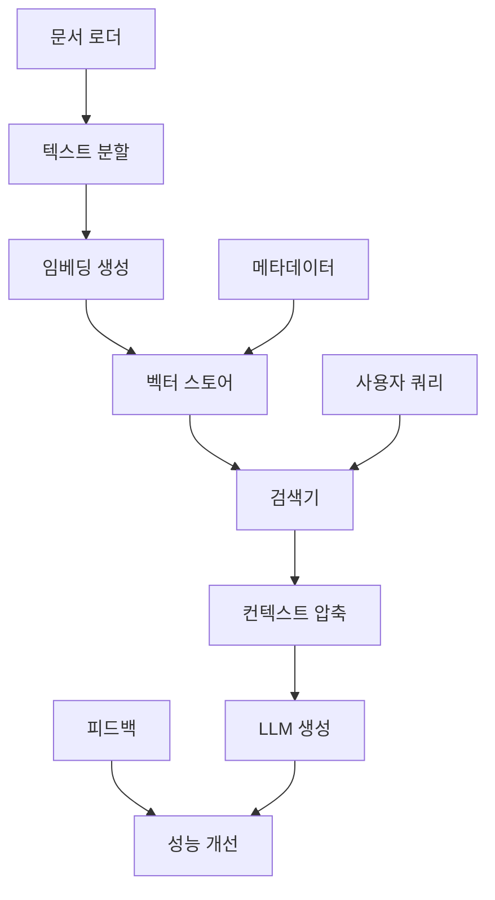

# RAG 시스템 구현 가이드

## 🎯 RAG (Retrieval-Augmented Generation) 개요

RAG는 외부 지식 베이스에서 관련 정보를 검색하여 LLM의 응답을 향상시키는 기술입니다. Project Maestro에서는 게임 개발 지식, Unity 문서, 베스트 프랙티스 등을 RAG로 활용합니다.

## 🏗️ RAG 아키텍처 설계

### 1. 핵심 컴포넌트



### 2. 데이터 파이프라인

#### 문서 수집 및 전처리
```python
class DocumentPipeline:
    """게임 개발 문서 처리 파이프라인"""
    
    def __init__(self):
        self.loaders = {
            "unity_docs": UnityDocumentLoader(),
            "game_design": GameDesignLoader(),
            "code_examples": CodeExampleLoader(),
            "best_practices": BestPracticeLoader()
        }
        
        self.text_splitter = RecursiveCharacterTextSplitter(
            chunk_size=1000,
            chunk_overlap=200,
            separators=["\n\n", "\n", ".", "!", "?", " "]
        )
    
    async def process_documents(self, source_type: str, path: str):
        """문서 로딩 및 처리"""
        loader = self.loaders[source_type]
        raw_documents = await loader.load(path)
        
        # 메타데이터 추가
        for doc in raw_documents:
            doc.metadata.update({
                "source_type": source_type,
                "processed_at": datetime.now().isoformat(),
                "chunk_strategy": "recursive"
            })
        
        # 문서 분할
        chunks = self.text_splitter.split_documents(raw_documents)
        
        return chunks
```

#### 임베딩 전략
```python
class HybridEmbeddingStrategy:
    """비용 효율적인 하이브리드 임베딩"""
    
    def __init__(self):
        # 고품질 임베딩 (중요 문서용)
        self.openai_embeddings = OpenAIEmbeddings(
            model="text-embedding-3-large",
            dimensions=1536
        )
        
        # 로컬 임베딩 (일반 문서용)
        self.local_embeddings = SentenceTransformerEmbeddings(
            model_name="all-MiniLM-L6-v2"
        )
        
        # 코드 특화 임베딩
        self.code_embeddings = SentenceTransformerEmbeddings(
            model_name="microsoft/CodeBERT-base"
        )
    
    async def embed_document(self, doc: Document) -> List[float]:
        """문서 타입별 최적 임베딩 선택"""
        if doc.metadata.get("importance") == "high":
            return await self.openai_embeddings.aembed_query(doc.page_content)
        elif doc.metadata.get("content_type") == "code":
            return await self.code_embeddings.aembed_query(doc.page_content)
        else:
            return await self.local_embeddings.aembed_query(doc.page_content)
```

### 3. 벡터 스토어 최적화

#### Chroma DB 설정
```python
class OptimizedVectorStore:
    """성능 최적화된 벡터 스토어"""
    
    def __init__(self, persist_directory: str = "data/vectorstore"):
        self.persist_directory = persist_directory
        
        # HNSW 인덱스 최적화 설정
        self.collection_metadata = {
            "hnsw:space": "cosine",           # 코사인 유사도
            "hnsw:construction_ef": 400,     # 인덱스 구축 품질
            "hnsw:M": 16,                    # 연결 수 (메모리 vs 속도)
            "hnsw:search_ef": 100            # 검색 품질
        }
        
    async def initialize(self, embeddings: Embeddings):
        """벡터 스토어 초기화"""
        self.vector_store = Chroma(
            persist_directory=self.persist_directory,
            embedding_function=embeddings,
            collection_metadata=self.collection_metadata
        )
        
        # 컬렉션별 분리 (게임 타입별)
        self.collections = {
            "unity_docs": self._create_collection("unity_docs"),
            "game_patterns": self._create_collection("game_patterns"),
            "code_examples": self._create_collection("code_examples")
        }
    
    def _create_collection(self, collection_name: str):
        """특화된 컬렉션 생성"""
        return Chroma(
            collection_name=collection_name,
            persist_directory=f"{self.persist_directory}/{collection_name}",
            embedding_function=self.embeddings,
            collection_metadata=self.collection_metadata
        )
```

#### 메타데이터 스키마
```python
class DocumentMetadata(BaseModel):
    """문서 메타데이터 스키마"""
    
    # 기본 정보
    source_type: str          # unity_docs, game_design, code_example
    content_type: str         # text, code, image, audio
    language: str = "ko"      # 언어 설정
    
    # 게임 개발 특화
    game_genre: Optional[str] = None      # platformer, rpg, puzzle
    unity_version: Optional[str] = None   # Unity 버전 호환성
    platform: Optional[str] = None       # mobile, desktop, web
    
    # 품질 지표
    importance: str = "medium"            # high, medium, low
    confidence_score: float = 0.8         # 문서 신뢰도
    last_updated: datetime                # 최종 업데이트
    
    # 접근 제어
    access_level: str = "public"          # public, internal, restricted
    tags: List[str] = []                  # 검색 태그
```

## 🔍 고급 검색 전략

### 1. Multi-Query RAG
```python
class MultiQueryRAG:
    """다중 쿼리를 통한 향상된 검색"""
    
    def __init__(self, llm: BaseLanguageModel, vector_store: VectorStore):
        self.llm = llm
        self.vector_store = vector_store
        
        # 쿼리 생성 체인
        self.query_generation_chain = (
            ChatPromptTemplate.from_template(
                """다음 질문에 대해 3가지 다른 관점의 검색 쿼리를 생성하세요:
                
                원본 질문: {question}
                
                검색 쿼리들 (각 줄에 하나씩):"""
            )
            | self.llm
            | StrOutputParser()
            | RunnableLambda(lambda x: [q.strip() for q in x.split("\n") if q.strip()])
        )
    
    async def multi_query_retrieve(self, question: str, k: int = 5) -> List[Document]:
        """다중 쿼리를 통한 검색"""
        # 다양한 쿼리 생성
        queries = await self.query_generation_chain.ainvoke({"question": question})
        
        # 각 쿼리로 검색
        all_docs = []
        for query in queries:
            docs = await self.vector_store.asimilarity_search(query, k=k//len(queries)+1)
            all_docs.extend(docs)
        
        # 중복 제거 및 재순위화
        unique_docs = self._remove_duplicates(all_docs)
        reranked_docs = await self._rerank_documents(question, unique_docs)
        
        return reranked_docs[:k]
    
    def _remove_duplicates(self, docs: List[Document]) -> List[Document]:
        """문서 중복 제거"""
        seen = set()
        unique_docs = []
        
        for doc in docs:
            # 내용 해시로 중복 판정
            content_hash = hash(doc.page_content)
            if content_hash not in seen:
                seen.add(content_hash)
                unique_docs.append(doc)
                
        return unique_docs
    
    async def _rerank_documents(self, query: str, docs: List[Document]) -> List[Document]:
        """문서 재순위화"""
        # 간단한 TF-IDF 기반 재순위화 (실제로는 cross-encoder 사용 권장)
        scores = []
        for doc in docs:
            relevance = await self._calculate_relevance(query, doc.page_content)
            scores.append((doc, relevance))
        
        # 점수 기준 정렬
        ranked_docs = sorted(scores, key=lambda x: x[1], reverse=True)
        return [doc for doc, score in ranked_docs]
```

### 2. HyDE (Hypothetical Document Embedding)
```python
class HyDERAG:
    """가상 문서 임베딩을 통한 검색 향상"""
    
    def __init__(self, llm: BaseLanguageModel, vector_store: VectorStore):
        self.llm = llm
        self.vector_store = vector_store
        
        # HyDE 프롬프트
        self.hyde_prompt = ChatPromptTemplate.from_template(
            """다음 질문에 대한 상세하고 정확한 답변을 작성하세요:
            
            질문: {question}
            
            답변:"""
        )
        
        # HyDE 체인
        self.hyde_chain = (
            self.hyde_prompt
            | self.llm
            | StrOutputParser()
        )
    
    async def hyde_retrieve(self, question: str, k: int = 5) -> List[Document]:
        """HyDE 방식 검색"""
        # 1단계: 가상 답변 생성
        hypothetical_answer = await self.hyde_chain.ainvoke({"question": question})
        
        # 2단계: 가상 답변으로 유사도 검색
        docs = await self.vector_store.asimilarity_search(hypothetical_answer, k=k*2)
        
        # 3단계: 원본 질문과의 관련성으로 재필터링
        filtered_docs = await self._filter_by_relevance(question, docs, k)
        
        return filtered_docs
    
    async def _filter_by_relevance(
        self, 
        original_question: str, 
        docs: List[Document], 
        k: int
    ) -> List[Document]:
        """원본 질문과의 관련성으로 필터링"""
        # 원본 질문으로 유사도 재계산
        original_results = await self.vector_store.asimilarity_search(original_question, k=k)
        original_content = {doc.page_content for doc in original_results}
        
        # 교집합 우선, 그 다음 HyDE 결과
        prioritized_docs = []
        seen_content = set()
        
        # 1순위: 두 방법 모두에서 검색된 문서
        for doc in docs:
            if doc.page_content in original_content and doc.page_content not in seen_content:
                prioritized_docs.append(doc)
                seen_content.add(doc.page_content)
        
        # 2순위: HyDE에서만 검색된 문서
        for doc in docs:
            if doc.page_content not in seen_content and len(prioritized_docs) < k:
                prioritized_docs.append(doc)
                seen_content.add(doc.page_content)
        
        return prioritized_docs[:k]
```

### 3. Contextual Compression
```python
class ContextualCompressionRAG:
    """컨텍스트 압축을 통한 정보 정제"""
    
    def __init__(self, llm: BaseLanguageModel, retriever: BaseRetriever):
        self.llm = llm
        self.retriever = retriever
        
        # 압축 프롬프트
        self.compression_prompt = ChatPromptTemplate.from_template(
            """다음 컨텍스트에서 주어진 질문과 관련된 핵심 정보만 추출하세요:
            
            질문: {question}
            
            컨텍스트:
            {context}
            
            핵심 정보:
            - 질문과 직접 관련된 내용만 포함
            - 구체적인 예시나 코드가 있다면 포함
            - 불필요한 일반론은 제외
            
            추출된 정보:"""
        )
        
        # 압축 체인
        self.compression_chain = (
            self.compression_prompt
            | self.llm
            | StrOutputParser()
        )
    
    async def compressed_retrieve(self, question: str, k: int = 10) -> List[Document]:
        """압축된 검색 결과 반환"""
        # 1단계: 기본 검색 (더 많은 문서 검색)
        raw_docs = await self.retriever.aget_relevant_documents(question)
        
        # 2단계: 각 문서별 압축
        compressed_docs = []
        for doc in raw_docs[:k*2]:  # 2배 검색 후 압축
            compressed_content = await self.compression_chain.ainvoke({
                "question": question,
                "context": doc.page_content
            })
            
            # 의미 있는 압축이 이루어진 경우만 포함
            if len(compressed_content.strip()) > 50:  # 최소 길이 체크
                compressed_doc = Document(
                    page_content=compressed_content,
                    metadata={
                        **doc.metadata,
                        "compression_applied": True,
                        "original_length": len(doc.page_content),
                        "compressed_length": len(compressed_content)
                    }
                )
                compressed_docs.append(compressed_doc)
        
        return compressed_docs[:k]
```

## 🎮 게임 개발 특화 RAG

### 1. Unity 문서 RAG 시스템
```python
class UnityRAGSystem:
    """Unity 개발 특화 RAG 시스템"""
    
    def __init__(self):
        self.unity_version = "2023.2.0f1"
        
        # Unity 문서 구조
        self.document_categories = {
            "api_reference": "Unity API 레퍼런스",
            "tutorials": "Unity 튜토리얼",
            "best_practices": "Unity 베스트 프랙티스",
            "performance": "성능 최적화 가이드",
            "platform_specific": "플랫폼별 개발 가이드"
        }
        
        # 게임 장르별 패턴
        self.genre_patterns = {
            "platformer": {
                "movement_patterns": "플랫포머 이동 패턴",
                "physics_setup": "물리 설정",
                "level_design": "레벨 디자인 원칙"
            },
            "rpg": {
                "inventory_system": "인벤토리 시스템",
                "character_progression": "캐릭터 성장",
                "quest_system": "퀘스트 시스템"
            }
        }
    
    async def create_unity_rag_chain(self, target_genre: str = None):
        """Unity 특화 RAG 체인 생성"""
        
        # 장르별 필터링 retriever
        genre_retriever = self.vector_store.as_retriever(
            search_kwargs={
                "k": 10,
                "filter": {"genre": target_genre} if target_genre else {}
            }
        )
        
        # Unity 특화 프롬프트
        unity_prompt = ChatPromptTemplate.from_template(
            """당신은 Unity 게임 개발 전문가입니다. 다음 Unity 문서를 바탕으로 정확하고 실용적인 답변을 제공하세요.

Unity 문서:
{context}

개발자 질문: {question}

답변 가이드라인:
1. Unity {unity_version} 기준으로 답변
2. 구체적인 코드 예시 포함
3. 성능 고려사항 언급
4. 플랫폼별 차이점 설명
5. 베스트 프랙티스 권장사항

답변:"""
        )
        
        # Unity RAG 체인
        unity_chain = (
            RunnableParallel({
                "context": genre_retriever | self._format_unity_docs,
                "question": RunnablePassthrough(),
                "unity_version": RunnableLambda(lambda _: self.unity_version)
            })
            | unity_prompt
            | self.llm
            | StrOutputParser()
        )
        
        return unity_chain
    
    def _format_unity_docs(self, docs: List[Document]) -> str:
        """Unity 문서 포맷팅"""
        formatted_sections = []
        
        for doc in docs:
            section = f"[{doc.metadata.get('category', 'General')}]"
            if 'api_class' in doc.metadata:
                section += f" API: {doc.metadata['api_class']}"
            if 'unity_version' in doc.metadata:
                section += f" (Unity {doc.metadata['unity_version']})"
            
            section += f"\n{doc.page_content}\n"
            formatted_sections.append(section)
        
        return "\n---\n".join(formatted_sections)
```

### 2. 게임 디자인 패턴 RAG
```python
class GameDesignPatternRAG:
    """게임 디자인 패턴 특화 RAG"""
    
    def __init__(self, llm: BaseLanguageModel):
        self.llm = llm
        
        # 디자인 패턴 분류
        self.pattern_categories = {
            "behavioral": "행동 패턴 (플레이어 행동, AI)",
            "structural": "구조 패턴 (데이터, 아키텍처)",
            "gameplay": "게임플레이 패턴 (루프, 진행)",
            "ui_ux": "UI/UX 패턴 (인터페이스, 피드백)"
        }
    
    async def create_pattern_rag_chain(self):
        """게임 디자인 패턴 RAG 체인"""
        
        # 패턴 분석 프롬프트
        pattern_prompt = ChatPromptTemplate.from_template(
            """게임 디자인 패턴 전문가로서 다음 요청을 분석하고 적절한 패턴을 제안하세요.

관련 패턴 문서:
{context}

게임 요구사항: {question}

분석 결과:
1. 적용 가능한 패턴: 
2. 구현 방법:
3. 예상 문제점:
4. 대안 패턴:
5. 성능 고려사항:

상세 답변:"""
        )
        
        # 패턴별 retriever
        pattern_retriever = self.vector_store.as_retriever(
            search_type="mmr",  # Maximum Marginal Relevance
            search_kwargs={
                "k": 8,
                "lambda_mult": 0.7  # 다양성 vs 관련성 균형
            }
        )
        
        # 패턴 RAG 체인
        pattern_chain = (
            RunnableParallel({
                "context": pattern_retriever | self._format_patterns,
                "question": RunnablePassthrough()
            })
            | pattern_prompt
            | self.llm
            | StrOutputParser()
        )
        
        return pattern_chain
    
    def _format_patterns(self, docs: List[Document]) -> str:
        """패턴 문서 포맷팅"""
        sections = []
        
        for doc in docs:
            pattern_name = doc.metadata.get("pattern_name", "Unknown Pattern")
            category = doc.metadata.get("category", "General")
            complexity = doc.metadata.get("complexity", "Medium")
            
            section = f"""
== {pattern_name} ({category}) ==
복잡도: {complexity}
내용: {doc.page_content}
"""
            sections.append(section)
        
        return "\n".join(sections)
```

### 3. 코드 예시 RAG
```python
class CodeExampleRAG:
    """Unity C# 코드 예시 특화 RAG"""
    
    def __init__(self, llm: BaseLanguageModel):
        self.llm = llm
        
        # 코드 분석 체인
        self.code_analysis_chain = (
            ChatPromptTemplate.from_template(
                """Unity C# 코드 전문가로서 다음 코드 예시들을 분석하고 요청에 맞는 솔루션을 제공하세요.

관련 코드 예시들:
{context}

개발 요구사항: {question}

솔루션:
1. 추천 접근법:
2. 핵심 코드:
```csharp
// 여기에 Unity C# 코드 작성
```
3. 성능 최적화:
4. 주의사항:
5. 테스트 방법:

상세 설명:"""
            )
            | self.llm
            | StrOutputParser()
        )
    
    async def get_code_solution(self, requirement: str) -> str:
        """코드 요구사항에 대한 솔루션 제공"""
        
        # 코드 특화 검색
        code_docs = await self._search_code_examples(requirement)
        
        # 코드 솔루션 생성
        solution = await self.code_analysis_chain.ainvoke({
            "context": self._format_code_examples(code_docs),
            "question": requirement
        })
        
        return solution
    
    async def _search_code_examples(self, requirement: str) -> List[Document]:
        """코드 예시 검색"""
        # 코드 특화 키워드 추출
        code_keywords = await self._extract_code_keywords(requirement)
        
        # 키워드별 검색
        all_examples = []
        for keyword in code_keywords:
            examples = await self.vector_store.asimilarity_search(
                keyword,
                k=3,
                filter={"content_type": "code"}
            )
            all_examples.extend(examples)
        
        # 중복 제거 및 관련성 정렬
        unique_examples = self._deduplicate_code_examples(all_examples)
        return unique_examples[:5]
    
    def _format_code_examples(self, docs: List[Document]) -> str:
        """코드 예시 포맷팅"""
        formatted = []
        
        for i, doc in enumerate(docs, 1):
            example_title = doc.metadata.get("title", f"예시 {i}")
            unity_version = doc.metadata.get("unity_version", "N/A")
            
            formatted.append(f"""
=== 예시 {i}: {example_title} (Unity {unity_version}) ===
{doc.page_content}
""")
        
        return "\n".join(formatted)
```

## 🔧 통합 RAG 시스템

### 1. 마스터 RAG 오케스트레이터
```python
class MaestroRAGSystem:
    """Project Maestro 통합 RAG 시스템"""
    
    def __init__(self):
        # 특화된 RAG 시스템들
        self.unity_rag = UnityRAGSystem()
        self.pattern_rag = GameDesignPatternRAG()
        self.code_rag = CodeExampleRAG()
        
        # 쿼리 분류기
        self.query_classifier = self._create_query_classifier()
    
    def _create_query_classifier(self):
        """쿼리 타입 분류기"""
        classification_prompt = ChatPromptTemplate.from_template(
            """다음 질문을 가장 적절한 카테고리로 분류하세요:

카테고리:
- unity_api: Unity API 사용법
- game_pattern: 게임 디자인 패턴
- code_example: 코드 구현 예시
- general: 일반적인 게임 개발

질문: {question}

카테고리: """
        )
        
        return (
            classification_prompt
            | self.llm
            | StrOutputParser()
            | RunnableLambda(lambda x: x.strip().lower())
        )
    
    async def intelligent_retrieve(self, question: str) -> str:
        """지능적 RAG 검색 및 응답"""
        
        # 1단계: 쿼리 분류
        category = await self.query_classifier.ainvoke({"question": question})
        
        # 2단계: 특화된 RAG 시스템 선택
        if category == "unity_api":
            return await self.unity_rag.query(question)
        elif category == "game_pattern":
            return await self.pattern_rag.query(question)
        elif category == "code_example":
            return await self.code_rag.get_code_solution(question)
        else:
            # 통합 검색
            return await self._general_rag_query(question)
    
    async def _general_rag_query(self, question: str) -> str:
        """통합 RAG 쿼리"""
        
        # 모든 컬렉션에서 검색
        unity_docs = await self.unity_rag.search(question, k=3)
        pattern_docs = await self.pattern_rag.search(question, k=3)
        code_docs = await self.code_rag.search(question, k=3)
        
        # 통합 컨텍스트 구성
        all_docs = unity_docs + pattern_docs + code_docs
        context = self._format_mixed_context(all_docs)
        
        # 통합 응답 생성
        general_prompt = ChatPromptTemplate.from_template(
            """다양한 게임 개발 자료를 바탕으로 종합적인 답변을 제공하세요:

통합 컨텍스트:
{context}

질문: {question}

종합 답변:"""
        )
        
        general_chain = (
            RunnableParallel({
                "context": RunnableLambda(lambda _: context),
                "question": RunnablePassthrough()
            })
            | general_prompt
            | self.llm
            | StrOutputParser()
        )
        
        return await general_chain.ainvoke({"question": question})
```

### 2. 실시간 학습 시스템
```python
class AdaptiveRAGSystem:
    """사용자 피드백을 통한 적응형 RAG"""
    
    def __init__(self):
        self.feedback_store = FeedbackStore()
        self.learning_scheduler = LearningScheduler()
    
    async def query_with_feedback_loop(self, question: str, user_id: str) -> Dict:
        """피드백 루프가 포함된 RAG 쿼리"""
        
        # 1단계: 기본 RAG 응답
        response = await self.rag_chain.ainvoke({"question": question})
        
        # 2단계: 사용자 만족도 예측
        satisfaction_score = await self._predict_satisfaction(question, response)
        
        # 3단계: 낮은 점수 시 대안 검색
        if satisfaction_score < 0.7:
            alternative_response = await self._generate_alternative(question)
            response = alternative_response
        
        return {
            "response": response,
            "confidence": satisfaction_score,
            "query_id": str(uuid.uuid4()),
            "user_id": user_id
        }
    
    async def record_feedback(self, query_id: str, rating: float, comments: str = ""):
        """사용자 피드백 기록"""
        await self.feedback_store.record({
            "query_id": query_id,
            "rating": rating,
            "comments": comments,
            "timestamp": datetime.now()
        })
        
        # 주기적 모델 재학습 트리거
        await self.learning_scheduler.schedule_retraining()
    
    async def _predict_satisfaction(self, question: str, response: str) -> float:
        """응답 만족도 예측"""
        satisfaction_prompt = ChatPromptTemplate.from_template(
            """다음 질문-답변 쌍의 품질을 0-1 점수로 평가하세요:

질문: {question}
답변: {response}

평가 기준:
- 정확성: 기술적으로 올바른가?
- 완전성: 질문에 충분히 답했는가?
- 실용성: 실제로 적용 가능한가?
- 명확성: 이해하기 쉬운가?

점수 (0.0-1.0): """
        )
        
        score_str = await (satisfaction_prompt | self.llm | StrOutputParser()).ainvoke({
            "question": question,
            "response": response
        })
        
        try:
            return float(score_str.strip())
        except ValueError:
            return 0.5  # 기본값
```

## 📊 RAG 성능 최적화

### 1. 캐싱 전략
```python
import redis
from functools import lru_cache

class RAGCache:
    """RAG 응답 캐싱 시스템"""
    
    def __init__(self):
        self.redis_client = redis.Redis(
            host=settings.redis_host,
            port=settings.redis_port,
            decode_responses=True
        )
        
        # 메모리 캐시 (빠른 접근)
        self.memory_cache = {}
        self.max_memory_items = 1000
    
    @lru_cache(maxsize=500)
    def _embed_query_cached(self, query: str) -> str:
        """임베딩 결과 메모리 캐싱"""
        return self.embeddings.embed_query(query)
    
    async def get_cached_response(self, query: str) -> Optional[str]:
        """캐시된 응답 검색"""
        query_hash = hashlib.sha256(query.encode()).hexdigest()
        
        # 1단계: 메모리 캐시 확인
        if query_hash in self.memory_cache:
            return self.memory_cache[query_hash]
        
        # 2단계: Redis 캐시 확인
        cached_response = await self.redis_client.get(f"rag:{query_hash}")
        if cached_response:
            # 메모리 캐시에도 저장
            if len(self.memory_cache) < self.max_memory_items:
                self.memory_cache[query_hash] = cached_response
            return cached_response
        
        return None
    
    async def cache_response(self, query: str, response: str, ttl: int = 3600):
        """응답 캐싱"""
        query_hash = hashlib.sha256(query.encode()).hexdigest()
        
        # Redis에 TTL과 함께 저장
        await self.redis_client.setex(f"rag:{query_hash}", ttl, response)
        
        # 메모리 캐시에도 저장
        if len(self.memory_cache) < self.max_memory_items:
            self.memory_cache[query_hash] = response
```

### 2. 배치 처리 최적화
```python
class BatchRAGProcessor:
    """배치 RAG 처리 최적화"""
    
    async def batch_query_processing(self, questions: List[str], batch_size: int = 10):
        """배치 쿼리 처리"""
        
        # 임베딩 배치 처리
        embeddings = await self.embeddings.aembed_documents(questions)
        
        # 벡터 검색 배치 처리
        all_docs = []
        for embedding in embeddings:
            docs = await self.vector_store.asimilarity_search_by_vector(
                embedding, k=5
            )
            all_docs.append(docs)
        
        # LLM 배치 처리
        contexts = [self._format_docs(docs) for docs in all_docs]
        prompts = [self._create_prompt(q, c) for q, c in zip(questions, contexts)]
        
        responses = await self.llm.abatch(prompts, config={"max_concurrency": batch_size})
        
        return [response.content for response in responses]
    
    async def parallel_rag_chains(self, question: str) -> Dict[str, str]:
        """여러 RAG 체인 병렬 실행"""
        
        # 다양한 관점의 체인들
        chains = {
            "technical": self.technical_rag_chain,
            "creative": self.creative_rag_chain,
            "practical": self.practical_rag_chain
        }
        
        # 병렬 실행
        tasks = {
            name: chain.ainvoke({"question": question})
            for name, chain in chains.items()
        }
        
        results = await asyncio.gather(*tasks.values(), return_exceptions=True)
        
        return {
            name: result if not isinstance(result, Exception) else f"Error: {result}"
            for name, result in zip(chains.keys(), results)
        }
```

## 🎓 면접 핵심 포인트

### RAG 시스템 설계 시 고려사항

1. **데이터 품질**: 소스 문서의 품질이 RAG 성능을 좌우
2. **청킹 전략**: 의미 단위 분할로 검색 정확도 향상
3. **임베딩 선택**: 비용, 성능, 정확도의 균형
4. **검색 알고리즘**: 유사도, MMR, 필터링의 조합
5. **컨텍스트 길이**: LLM 컨텍스트 윈도우 크기 고려
6. **실시간 업데이트**: 새 문서 추가 시 즉시 반영
7. **피드백 루프**: 사용자 만족도를 통한 지속 개선

### 성능 병목지점 및 해결책

1. **임베딩 생성**: 비용이 높은 OpenAI API → 로컬 모델 하이브리드
2. **벡터 검색**: 대용량 데이터 → 인덱스 최적화, 계층적 검색
3. **LLM 호출**: 지연 시간 → 캐싱, 배치 처리
4. **메모리 사용량**: 큰 벡터 스토어 → 압축, 프루닝
5. **동시 요청**: 리소스 경합 → 연결 풀, 큐잉

이 가이드를 통해 AI 애플리케이션 엔지니어 면접에서 RAG 및 멀티 에이전트 시스템에 대한 깊이 있는 이해를 보여줄 수 있습니다.