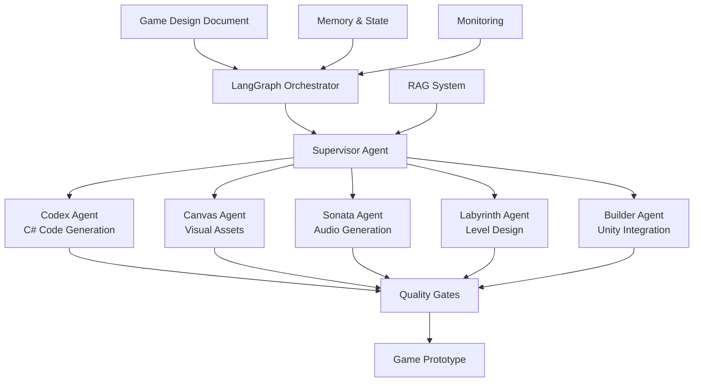

# Project Maestro: Technical Architecture Overview

## Executive Summary

Project Maestro is an advanced AI-powered game development automation system that leverages cutting-edge multi-agent orchestration to transform game design documents into playable prototypes. The system has evolved from a traditional ReAct framework to incorporate **LangGraph** for sophisticated agent coordination, enabling complex game development workflows through intelligent agent handoffs and state management.

## System Architecture

### High-Level Overview



### Core Components

#### 1. LangGraph Orchestration Layer
- **Multi-Agent Coordination**: Graph-based workflow execution
- **State Management**: Persistent workflow state with checkpointing
- **Intelligent Routing**: Context-aware agent selection
- **Parallel Execution**: Concurrent agent operations for efficiency

#### 2. Specialized AI Agents
- **Orchestrator**: Master coordinator and workflow manager
- **Codex**: C# code and Unity script generation
- **Canvas**: Visual asset creation using Stable Diffusion
- **Sonata**: Music and sound effect generation
- **Labyrinth**: Level design and gameplay mechanics
- **Builder**: Unity project integration and building

#### 3. Supporting Infrastructure
- **RAG System**: Knowledge retrieval and context enhancement
- **Message Queue**: Asynchronous task distribution (Redis/Celery)
- **Database Layer**: Project state and asset management (PostgreSQL)
- **Monitoring**: Real-time performance and health tracking

## Technology Stack

### Core Framework
- **Python 3.11+**: Primary development language
- **LangGraph 0.2+**: Multi-agent orchestration framework
- **LangChain 0.3+**: LLM integration and tooling
- **FastAPI**: REST API framework

### AI/ML Components
- **OpenAI GPT-4**: Primary language model
- **Anthropic Claude**: Alternative LLM option
- **Stable Diffusion**: Image generation
- **ChromaDB**: Vector database for RAG
- **Sentence Transformers**: Text embeddings

### Infrastructure
- **Redis**: Caching and message brokering
- **PostgreSQL**: Primary database
- **Docker**: Containerization
- **Unity 2023.2+**: Game engine integration

## Key Features

### 1. Advanced Multi-Agent Orchestration

**LangGraph Integration**
```python
# Example: Complex workflow coordination
async for result in orchestrator.execute_workflow(
    request="Create 2D platformer with custom assets",
    thread_id="game_project_001"
):
    print(f"Stage: {result.get('workflow_stage')}")
```

**Intelligent Agent Handoffs**
```python
@tool
def transfer_to_canvas(description: str) -> Command:
    return Command(
        goto="canvas",
        update={"task_context": {"asset_type": "sprite", "description": description}}
    )
```

### 2. Persistent State Management

**Workflow State Tracking**
```python
class MaestroState(TypedDict):
    messages: Sequence[BaseMessage]
    current_agent: str
    game_design_doc: Optional[Dict]
    assets_generated: Dict[str, List[str]]
    code_artifacts: Dict[str, str]
    workflow_stage: str
    handoff_history: List[Dict]
```

### 3. RAG-Enhanced Context

**Knowledge Integration**
- Game development best practices
- Unity documentation and patterns  
- Code examples and templates
- Asset creation guidelines

### 4. Quality Assurance System

**Multi-Layer Validation**
- Code quality checks
- Asset validation
- Workflow completeness verification
- Integration testing

## Architecture Patterns

### 1. Supervisor Pattern
Central coordinator manages task distribution and progress tracking.

### 2. Agent Handoff Pattern
Specialized agents transfer control based on task requirements.

### 3. Parallel Execution Pattern
Independent tasks execute simultaneously for efficiency.

### 4. Quality Gate Pattern
Validation checkpoints ensure output quality before progression.

## Performance Characteristics

### Scalability Metrics
- **Concurrent Workflows**: 100+ simultaneous projects
- **Agent Response Time**: <2 seconds average
- **Asset Generation**: 10-50 assets per minute
- **Code Generation**: 1000+ lines per minute

### Resource Utilization
- **Memory**: 2-8GB per workflow (depending on complexity)
- **CPU**: Optimized for multi-core execution
- **GPU**: Optional for enhanced asset generation
- **Storage**: 100MB-10GB per project

## API Interface

### REST API Endpoints

```python
# Project management
POST /api/v1/projects/create
GET /api/v1/projects/{project_id}/status
POST /api/v1/projects/{project_id}/execute

# Agent interactions
POST /api/v1/agents/{agent_name}/task
GET /api/v1/agents/status

# Asset management
GET /api/v1/assets/{project_id}
POST /api/v1/assets/upload

# Workflow monitoring
GET /api/v1/workflows/{thread_id}/state
GET /api/v1/workflows/{thread_id}/visualization
```

### WebSocket Interface

```python
# Real-time workflow updates
ws://api/v1/workflows/{thread_id}/stream

# Agent coordination events
ws://api/v1/agents/events

# Progress monitoring
ws://api/v1/projects/{project_id}/progress
```

## Security & Compliance

### Security Measures
- **API Authentication**: JWT-based access control
- **Input Validation**: Comprehensive request sanitization
- **Rate Limiting**: Request throttling and abuse prevention
- **Audit Logging**: Complete operation tracking

### Data Protection
- **Privacy Policy Management**: GDPR-compliant data handling
- **Conversation Memory**: Encrypted storage of session data
- **Asset Security**: Secure file storage and access control

## Deployment Architecture

### Development Environment
```yaml
# docker-compose.yml
services:
  api:
    image: project-maestro/api:latest
    environment:
      - LANGGRAPH_MEMORY_BACKEND=memory
      - OPENAI_API_KEY=${OPENAI_API_KEY}
  
  redis:
    image: redis:7-alpine
  
  postgres:
    image: postgres:15
```

### Production Environment
- **Kubernetes**: Container orchestration
- **Load Balancing**: Horizontal scaling support
- **Monitoring**: Prometheus + Grafana
- **Logging**: Structured logging with ELK stack

## Migration from ReAct Framework

### Before: Traditional AgentExecutor
```python
agent = create_openai_functions_agent(llm, tools, prompt)
executor = AgentExecutor(agent=agent, tools=tools)
result = executor.invoke({"input": user_request})
```

### After: LangGraph Orchestration
```python
orchestrator = LangGraphOrchestrator(agents, llm)
async for result in orchestrator.execute_workflow(user_request):
    # Stream processing with multi-agent coordination
    handle_result(result)
```

### Migration Benefits
- **Enhanced Coordination**: Intelligent agent routing
- **Better State Management**: Persistent workflow state
- **Improved Monitoring**: Real-time progress tracking
- **Scalable Architecture**: Graph-based execution model

## Future Roadmap

### Q1 2025: Enhanced Intelligence
- Machine learning-based agent routing
- Predictive workflow optimization
- Advanced context awareness

### Q2 2025: Platform Integration
- Unity Editor plugin
- VS Code extension
- Web-based development environment

### Q3 2025: Advanced Features
- Multi-modal asset generation
- Real-time collaboration
- Advanced game testing automation

### Q4 2025: Enterprise Features
- Multi-tenant architecture
- Advanced analytics and reporting
- Enterprise security compliance

## Development Workflow

### 1. Setup Development Environment
```bash
git clone https://github.com/project-maestro/project-maestro
cd project-maestro
python -m venv venv
source venv/bin/activate  # or `venv\Scripts\activate` on Windows
pip install -e ".[dev]"
```

### 2. Run Local Development
```bash
# Start infrastructure
docker-compose up -d redis postgres

# Run API server
uvicorn project_maestro.api.main:app --reload

# Run Celery workers
celery -A project_maestro.core.message_queue worker --loglevel=info
```

### 3. Testing
```bash
# Run unit tests
pytest tests/unit/

# Run integration tests
pytest tests/integration/

# Run end-to-end tests
pytest tests/e2e/
```

## Monitoring & Observability

### Metrics Collection
- **Agent Performance**: Execution times, success rates
- **Workflow Health**: Progress tracking, error rates
- **Resource Usage**: Memory, CPU, storage utilization
- **Business Metrics**: Projects completed, user satisfaction

### Logging Strategy
```python
# Structured logging with context
logger.info(
    "Agent task completed",
    agent_name="codex",
    task_id="task_123",
    execution_time=2.5,
    success=True
)
```

### Alerting System
- **Performance Degradation**: Response time increases
- **Error Rate Spikes**: Agent or workflow failures
- **Resource Exhaustion**: Memory or storage limits
- **System Health**: Infrastructure component failures

## Conclusion

Project Maestro represents a significant advancement in AI-powered game development automation. The integration of LangGraph for multi-agent orchestration, combined with specialized AI agents and robust infrastructure, creates a powerful platform capable of transforming game ideas into playable prototypes with unprecedented efficiency and quality.

The system's architecture prioritizes scalability, maintainability, and extensibility, ensuring it can evolve with the rapidly advancing field of AI and game development. Whether you're creating simple 2D games or complex 3D experiences, Project Maestro provides the intelligent automation needed to bring your creative vision to life.